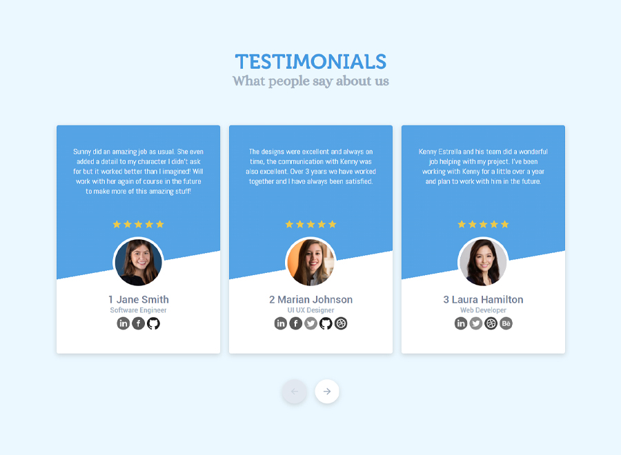

## Dynamic Testimonial Carousel Component
 
This is a project I started last July 2021 and finished just this month which I usually do on my free time. I noticed some problems on some carousel component that I used in the past. 

- The number of items displayed is affected when we resize the browser. In some cases, this is when start the slide I noticed that the current slid item(s) will change when you resize the browser. Example scenario, in page load, the website displays 3 items, when we click the right slide button, there will be 6 items slid now, that means the last item is number 6, when we resize the browser, in some cases, the 3rd or 4th or 5th item is displayed depending on the tranlateX used. 

- I experimented on different approach where the 'resize' event is really useful as well considering the number of slid items and the remaining items when right or left slide is clicked.

Live Site URL: [Live Demo](https://kennyestrella-testimonial-carousel-2.netlify.app/)

This is still a **WORK IN-PROGRESS**, where I'm still fixing bugs.

Sep 16 2021 - Fixed bugs on left and right slide functionalities.

Sep 15 2021 - Uploaded source files in this platform and hosted on Netlify.